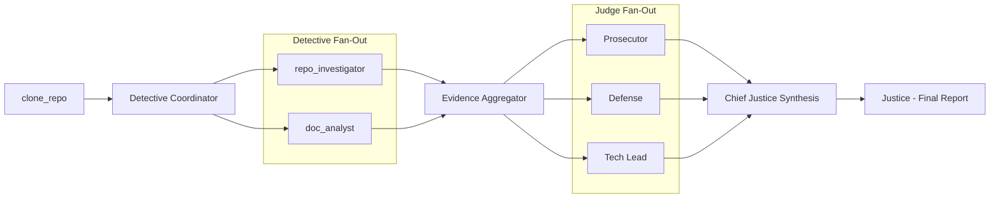

# Automaton Auditor

Automaton Auditor is a forensic, LangGraph-driven repository assessment system that combines code analysis, documentation retrieval, and multi-agent judicial synthesis into a reproducible audit workflow.

## Forensic Compliance Dashboard

| Rubric Dimension  | Implementation Proof                                                                                                                              |
| ----------------- | ------------------------------------------------------------------------------------------------------------------------------------------------- |
| State Management  | `AgentState` is modeled with `pydantic.BaseModel` and reducer-aware `Annotated` fields (e.g., `operator.add`) for deterministic fan-in merges.    |
| Orchestration     | Workflow is orchestrated through `langgraph.graph.StateGraph` with structured fan-out/fan-in execution across investigation and judicial phases.  |
| Safe Engineering  | Repository operations use `subprocess.run(..., shell=False, check=True)` with controlled inputs and defensive error handling.                     |
| Theoretical Depth | Scoring is normalized through dialectical synthesis across Prosecutor, Defense, and Tech Lead opinions, then consolidated by Chief Justice logic. |

The system also performs AST Parsing for code analysis and RAG-lite Retrieval for documentation cross-referencing.

## System Architecture



## Forensic Audit Metadata

| Criterion        | Technical Indicator                                                                    |
| ---------------- | -------------------------------------------------------------------------------------- |
| Orchestration    | Parallel `StateGraph` execution with explicit fan-out/fan-in transitions.              |
| State Management | Pydantic schema validation with reducer semantics for concurrent-safe state updates.   |
| Dialectics       | Multi-agent judicial panel (Prosecutor, Defense, Tech Lead) for adversarial reasoning. |
| Security         | Shell-isolated subprocess tooling plus environment-based secret management.            |
| Analysis         | AST code forensics and RAG-lite document retrieval for evidence enrichment.            |

## Technical Indicators

| Rubric Requirement      | Code Feature Mapping                                                                                      |
| ----------------------- | --------------------------------------------------------------------------------------------------------- |
| Typed state rigor       | `src/state.py` uses `BaseModel` schemas (`Evidence`, `JudicialOpinion`, `AgentState`).                    |
| Concurrency-safe merges | `Annotated[List[...], operator.add]` and reducer patterns preserve deterministic fan-in behavior.         |
| Secure execution        | `src/tools/repo_tools.py` and related nodes use `subprocess.run` with `shell=False`.                      |
| Judicial synthesis      | `src/nodes/judges.py` implements Prosecutor/Defense/TechLead generation and tie-break synthesis pipeline. |
| Documentation evidence  | `src/tools/doc_tools.py` applies RAG-lite chunk retrieval and rubric-query overlap selection.             |

## Quick Start

### Requirements

- Python `3.12.*`
- `uv` package manager
- `git` available on PATH

### Commands

| Task                 | Command                     | Purpose                                      |
| -------------------- | --------------------------- | -------------------------------------------- |
| Install dependencies | `uv sync`                   | Reproducible environment setup from lockfile |
| Run audit            | `uv run main.py <repo-url>` | Execute full forensic workflow               |
| Run tests            | `uv run pytest -q`          | Validate core behavior and state transitions |
| Format code          | `uv run black .`            | Normalize formatting                         |

> Configure API keys via `.env` (see `.env.example`) before running the audit pipeline.

## Project Structure

```text
src/
├── graph.py
├── state.py
├── nodes/
│   ├── detectives.py
│   ├── judges.py
│   └── justice.py
└── tools/
    ├── repo_tools.py
    └── doc_tools.py

main.py
tests/
audit/
result/
```

## Infrastructure

| Area                       | Practice                                                                            |
| -------------------------- | ----------------------------------------------------------------------------------- |
| Dependency reproducibility | `uv.lock` pins dependency graph for deterministic builds.                           |
| Runtime isolation          | Repository cloning occurs in controlled temporary workspace paths.                  |
| Secret handling            | API credentials are externalized in `.env`/`.env.example` instead of source code.   |
| Failure resilience         | Timeouts, exception handling, and fallback opinions reduce audit interruption risk. |

## Expected Outputs

- Real-time node execution traces in terminal output.
- Repository-specific markdown report in `audit/report_onself_generated/`.
- Latest mirrored report in `result/audit_result.md`.
